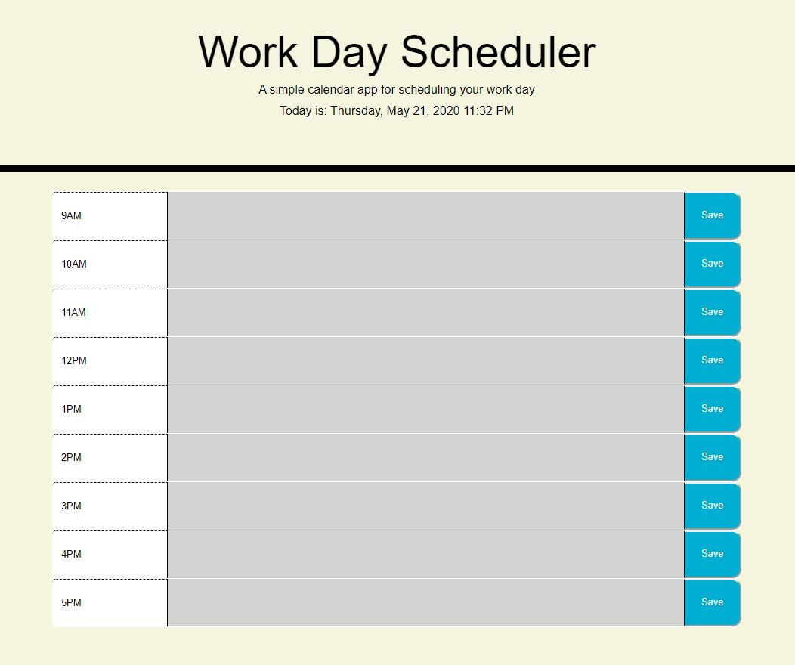

# Scheduler
This is a Work Day Scheduler Project.

It is daily scheduler to help the user plan his or her day ahead.

It will tell the time date of the day. User can use the textfield inside the bubble and press save to save the text.

The texts will be saved in local storage so that it will have data persistency.

This project has taught me how to user Jquery and string interpolation in complicated levels.

Moment.JS was a fine addition that helped me get the project done.

https://chong0810.github.io/Scheduler/